# Project 1 - Implementing LAMP Web Stack on the AWS Infrastructure
## What are TECHNOLOGY STACKs?
  : These are **WEB STACKS** are specific set of framework and tools that work together used to develop software.

  : There are four (4) types of web stacks
  - **LAMP - Linux, Apache, MySQL, PHP or Python, or Perl**
  - LEMP - Linux, Nginx, MySQL, PHP or Python, or Perl
  - MERN - MongoDB ExpressJS, ReactJS, NodeJS
  - MEAN - MongoDB, ExpressJS, AngularJS, NodeJS


## SELF STUDY
### What is the SDLC Cycle?
: The Software Development Life Cycle (SDLC) is a structured process that allows for the production of high-quality, low-cost software in the shortest amount of time.

: The SDLC's goal is to produce superior software that meets and exceeds all customer expectations and demands.

: The SDLC defines and outlines a detailed plan with stages, or phases, that each include their own process and deliverables.

### SDLC Phases
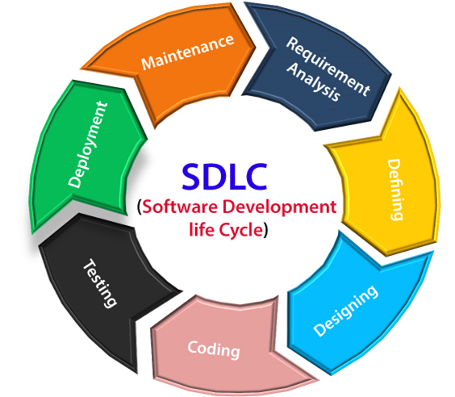


- **Planning phase**
  : The planning phase encompasses all aspects of project and product management. This typically includes resource allocation, capacity planning, project scheduling, cost estimation, and provisioning.

- **Coding phase**
  : The coding phase includes system design in an integrated development environment. It also includes static code analysis and code review for multiple types of devices.

- **Building phase**
  : The building phase takes the code requirements determined earlier and uses those to begin actually building the software.

- **Testing phase**
  : The phase entails the evaluation of the created software. The testing team evaluates the developed product(s) in order to assess whether they meet the requirements specified in the ‘planning’ phase. 
  
- **Release phase**
  : The release phase involves the team packaging, managing and deploying releases across different environments.

- **Deploy phase**
  : In the deployment phase, the software is officially released into the production environment. 

- **Operate phase**
  : The operate phase entails the use of the software in the production environment.

- **Monitor phase**
  : In the monitor phase, various elements of the software are monitored. These could include the overall system performance, user experience, new security vulnerabilities, an analysis of bugs or errors in the system.

  ### SDLC MODELS/METHODOLOGIES

- **Waterfall**
Waterfall represents the oldest, simplest, and most structured methodology. Each phase depends on the outcome of the previous phase, and all phases run sequentially. This model provides discipline and gives a tangible output at the end of each phase. However, this model doesn’t work well when flexibility is a requirement. There is little room for change once a phase is deemed complete, as changes can affect the cost, delivery time, and quality of the software.
- **Agile**
The agile methodology produces ongoing release cycles, each featuring small, incremental changes from the previous release. At each iteration, the product is tested. The agile model helps teams identify and address small issues in projects before they evolve into more significant problems. Teams can also engage business stakeholders and get their feedback throughout the development process.
- **Lean**
The lean methodology for software development is inspired by lean manufacturing practices and principles. The lean principles encourage creating better flow in work processes and developing a continuous improvement culture. The seven lean principles are:
1.  Eliminate waste
2.  Amplify learning
3.  Make decisions as late as possible
4.  Deliver as fast as possible
5.  Empower your team
6. 	Build integrity in
7. 	Build holistically

- **Iterative**
In the iterative process, each development cycle produces an incomplete but deployable version of the software. The first iteration implements a small set of the software requirements, and each subsequent version adds more requirements. The last iteration contains the complete requirement set.
- **Spiral**
In the spiral development model, the development process is driven by the unique risk patterns of a project. The development team evaluates the project and determines which elements of the other process models to incorporate. 
- **V-Shaped**
In the V-shaped model, verification phases and validation phases are run in parallel. Each verification phase is associated with a validation phase, and the model is run in a V-shape, where each phase of development has an associated phase of testing.


### LAMP STACK

***LAMP = Linux, Apache, MySQL, PHP/Python/Perl***

LAMP is an acronym for 

    the operating system, Linux;
    the web server, Apache;
    the database server, MySQL and;
    the programming language(s), PHP/Python,Perl.

Developers use to build websites and web applications. All the technologies are open source and it is one of the most common software stack for many web applications today.


### CHMOD – Change Mode
It a unix and linux operating system command used to change the access permissions of files or directories.

It allows or denys read or write privileges to a user or group of users.

```
syntax - chmod [options] mode filename

options: -R (recursive), -f (force), -v (verbose)

mode: read(r), write(w), execute(x)

1. Octal mode    
       owner            group          others
     r    w   x       r   w   x        r   w   x
     (4) (2) (1)     (4) (2) (1)      (4) (2) (1)

2. Symbolic mode
    : syntax: chmod references operator
 
 references:   u: owner of the file
               g: users who are member of file's group
               o: users who are neight u nor g
               a: all ugo
 
 operator:     + adds mode to specified classes
               - remove mode
               = exact mode to speicifed classes

 mode          r: read
               w: write
               x: execute
 e.g chomd u+x filename

d | rwx | rwx | rwx
d  = directory
-  = file

1st rwx = the owner 

2nd rwx = users or files group

3rd rwx = any other user

e.g chmod -R 774 filename


```

### CHOWN – Change Owner
It a unix and linux operating system command used to change ownership of files or directories.

It allows or denys read or write privileges to a user or group of users.

```
syntax - chown [options] owner:group filename

options: -R (recursive)

chown -R root:root filename

```

### TCP & UDP
: The OSI(Open Systems Interconnection) model is a conceptual framework used to descript the function of a computer networking system.

: TCP – Transmission Control Protocol 
Is connection oriented and relies on the 3-way handshake for communication

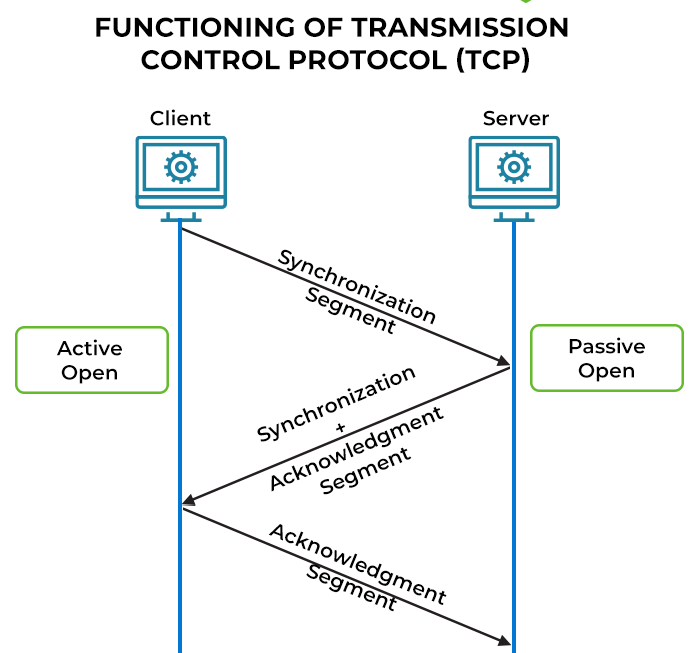

: UDP – User Datagram Protocol
Is a message-oriented communication protocol that allows computing devices and applications to send data via a network without verifying its delivery, which is best suited to real-time communication and broadcast systems. 

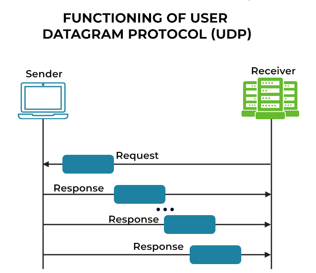

## Port numbers
: A port number is a way to identify a specific process to which an internet or other network message is to be forwarded when it arrives at a server. All network-connected devices come equipped with standardized ports that have an assigned number.

### Commoon Port numbers
- http 8080
- https 443
- ssh 22
- telnet 23
- ftp 20, 21
- sftp 22


## HANDS-ON LAB
### LAMP STACK IMPLEMENTATION
### Step 1 - Install Apache and Updating the firewall
   
  > update a list of packages in package manager
    
    sudo apt update
    
  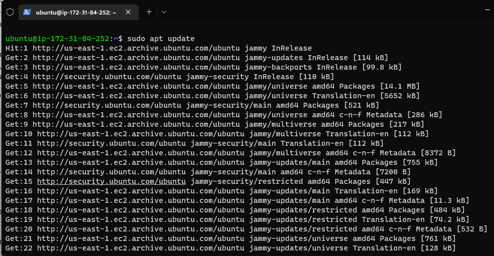

  > run apache2 package installation

    sudo apt install apache2
  
  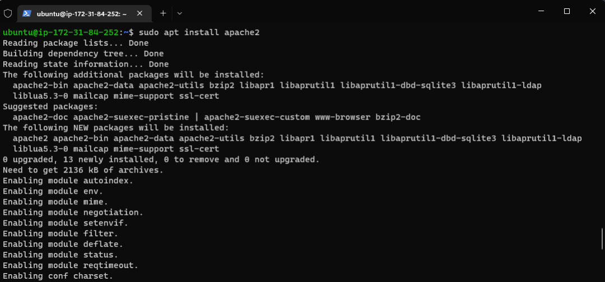
  
  > verify apache is running as a service in our os
    
    sudo systemctl status apache2
  
  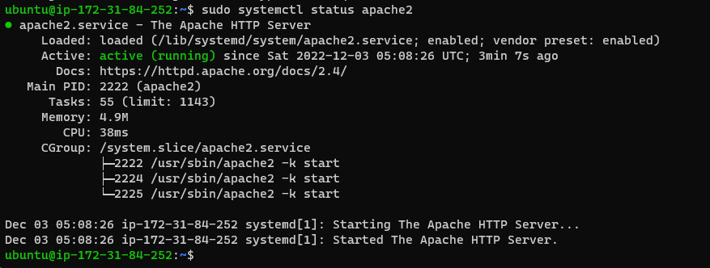
  
  > Updating the firewall

  
    
  > Accessing the apache server locally 
   
    curl http:/localhost:80 or curl http://127.0.0.1:80

  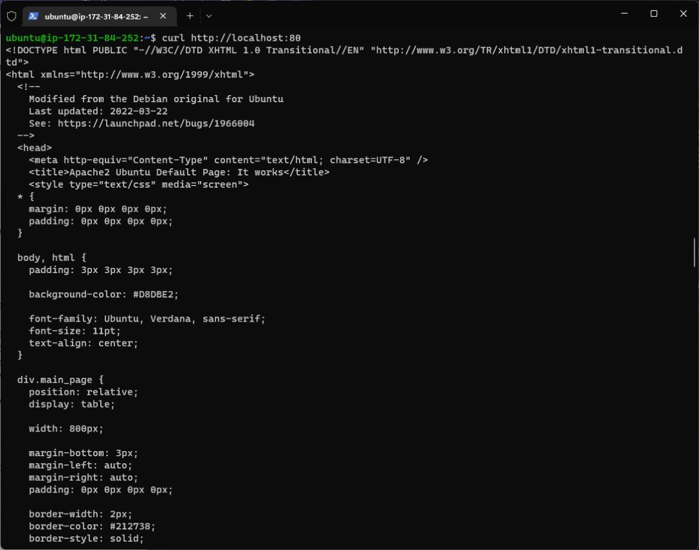

  > Accessing the apache server publically
    
    http://<Public-IP-Address>:80 - run from browser

    curl -s http://169.254.169.254/latest/meta-data/public-ipv4 - run from terminal

  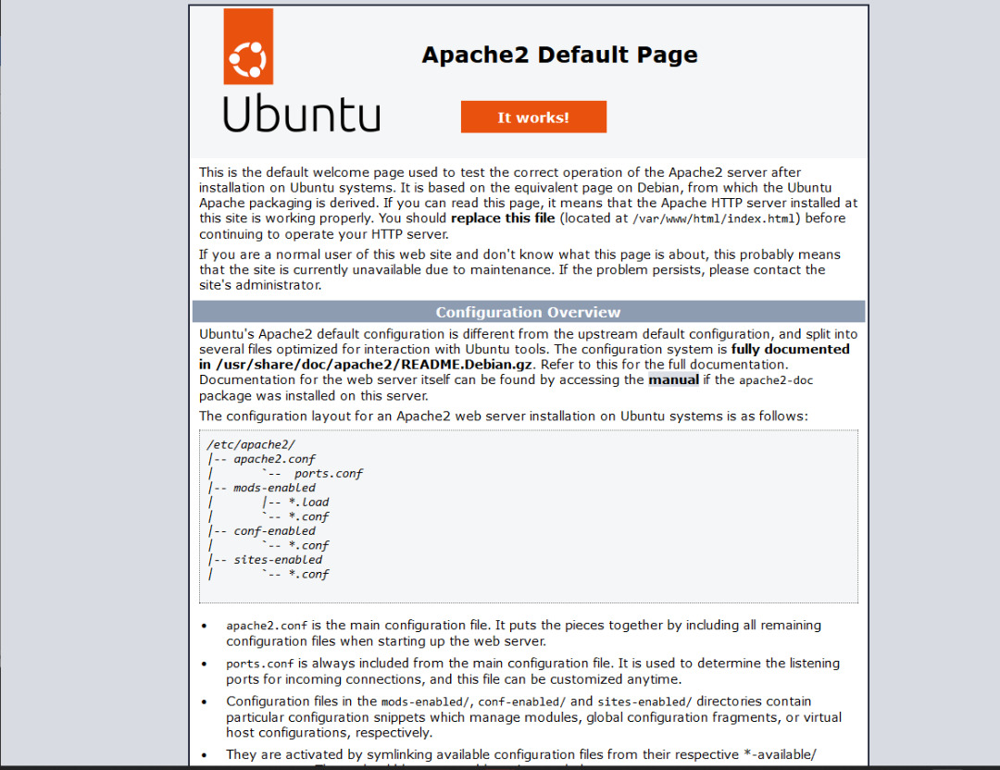

  

## STEP 2 - INSTALLING MySQL

> Installing mysql-server
  
    sudo apt install mysql-server

  

> Log into the MySQL console 
   
    sudo mysql 

  

> Setting a pssword for the root user

    ALTER USER 'root'@'localhost' IDENTIFIED WITH mysql_native_password BY 'PassWord.1';
  
  

> Exit the MySQL shell
  
    exit 
  
  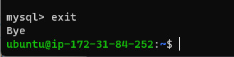

> Start the interactive script by running
    
    sudo mysql_secure_installation
  
  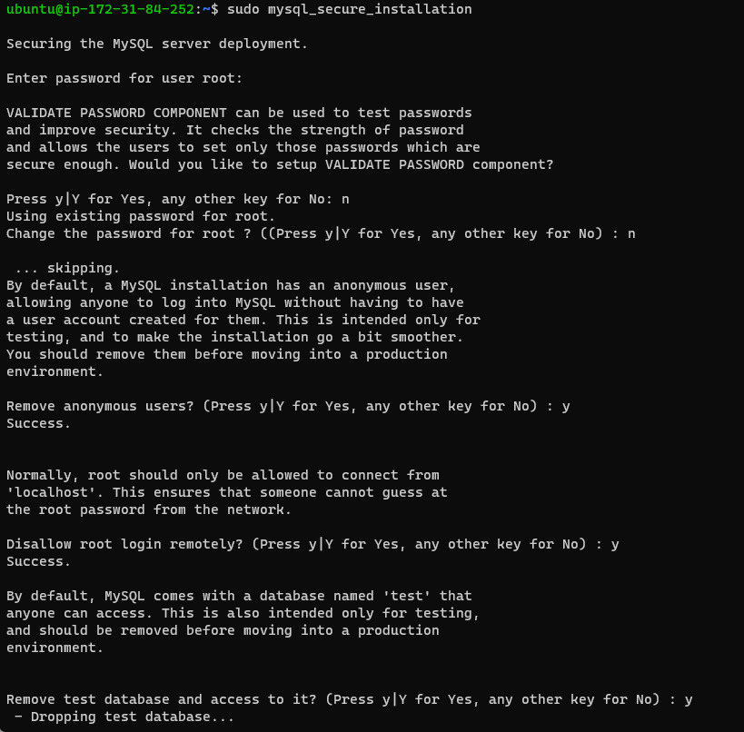

> Log in to the MySQL console
  
    sudo mysql -p
  

> Exit the MySQL shell

    exit
  
  

## Step 3 - Installing php

> Installing php packages
  
     sudo apt install php libapache2-mod-php php-mysql
  
  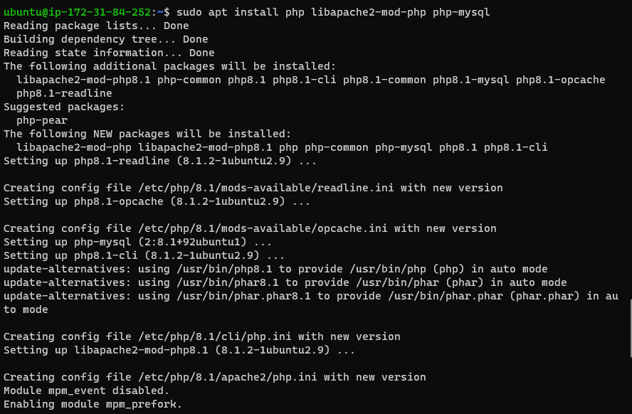

> confirming installation of php packages
    
    php -v
  
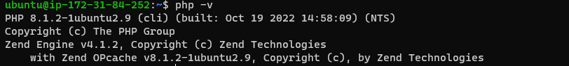

**NOTE: At this point, your LAMP stack is completely installed and fully operational.**
 
  - Linux(ubuntu)
  - Apache HTTP Server
  - MySQL
  - PHP


## Creating a Virtual host for your website
> Testing your setup with a PHP script
   
    sudo mkdir /var/www/projectlamp

> Assign ownership of the directory with your current system user
   
    sudo chown -R $USER:$USER /var/www/projectlamp
    
> Create and open a enw configuration file in Apache's **sites-available** directory and paste the following...
  
    sudo vi /etc/apache2/sites-available/projectlamp.conf

    <VirtualHost *:80>
       ServerName projectlamp
       ServerAlias www.projectlamp 
       ServerAdmin webmaster@localhost
       DocumentRoot /var/www/projectlamp
       ErrorLog ${APACHE_LOG_DIR}/error.log
       CustomLog ${APACHE_LOG_DIR}/access.log combined
    </VirtualHost>
    
    note: save and close the new files after pasting

> show the new file in the **sites-available** directory
     
     sudo ls /etc/apache2/sites-available

> Output show look something like this

     000-default.conf  default-ssl.conf  projectlamp.conf
  
  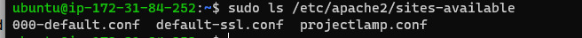

> Enable the new virtual host using a2ensite
    
     sudo a2ensite projectlamp

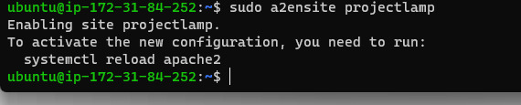

> Disable the default apache webpage

     sudo a2dissite 000-default

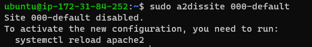

> Check for syntax error in the configuration files
     
     sudo apache2ctl configtest
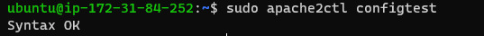

> Reload Apache to effect changes
  
     sudo systemctl reload apache2

**the new website is active, but the root /var/www/projectlamp is still empty**
     
> Create an index.html file in that location to test that the virtual host works as expected.

     sudo echo 'Hello LAMP from hostname' $(curl -s http://169.254.169.254/latest/meta-data/public-hostname) 'with public IP' $(curl -s http://169.254.169.254/latest/meta-data/public-ipv4) > /var/www/projectlamp/index.html

> Open the URL in your web browser
 
    http://<Public-IP-Address>:80

    http://44.212.67.132/
  
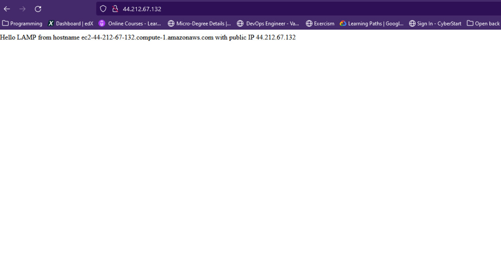
    
    http://<Public-DNS-Name>:80

    http://ec2-44-212-67-132.compute-1.amazonaws.com:80

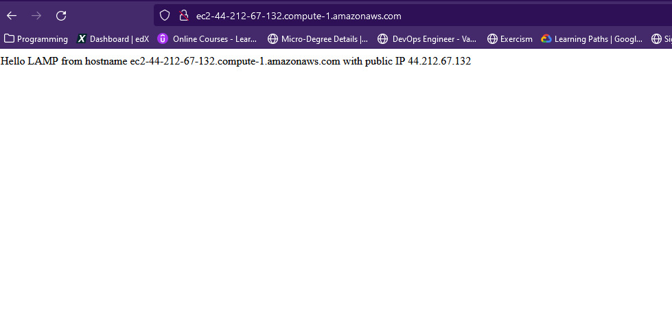

### Step 5 - Enable php on the website

> Open the configuration file

    sudo vim /etc/apache2/mods-enabled/dir.conf

> Modify the configuration file
   
    <IfModule mod_dir.c>
        #Change this:
        #DirectoryIndex index.html index.cgi index.pl index.php index.xhtml index.htm
        #To this:
        DirectoryIndex index.php index.html index.cgi index.pl index.xhtml index.htm
    </IfModule>

> Save and close the file then reload Apache web server
    
    sudo systemctl reload apache2

> Create a php script to test that php is correctly installed and confiured on your server.
    
    vim /var/www/projectlamp/index.php

> paste the following into the new file.
    
    <?php
    phpinfo();

> Save and close the file, then refresh the page


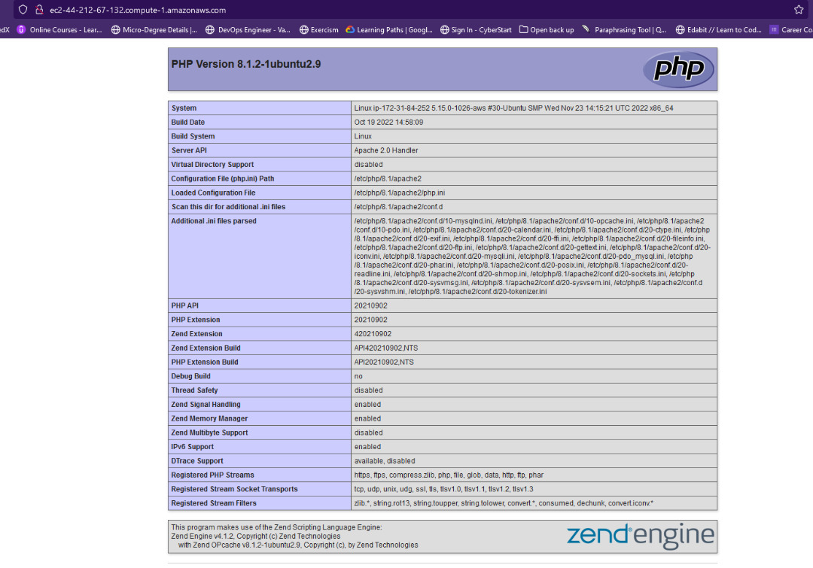
   
   
